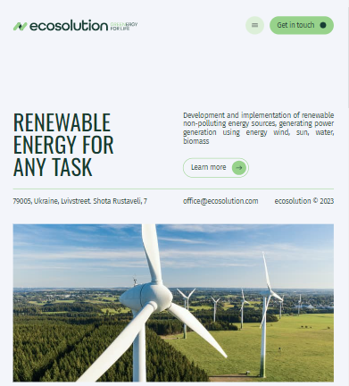

#  Ecosolution - RENEWABLE ENERGY For any task!

## Description:
Ecosolution is fully responsive design, oriented to any device (mobile, tablet, desktop).
This app offers development and implementation of renewable non-polluting energy sources, generating power generation using energy wind, sun, water, biomass.
Ecosolution [Live page](https://yulyarudenko88.github.io/SoftRyzen-test/).

### Features:
 You can view the values ​​that guide our team (`"About section"`), projects that have been successfully implemented in recent years (`"Cases section"`), contact us to discuss your ideas further (`"Contact Us section"`) or view the answers to the questions we receive most often (`"FAQ section"`), maybe your solution is already there.

### Technologies Used:
- **HTML/CSS** 
- **JavaScript** 
- **React** 
- **React-router-dom** 
- **React-loader-spinner** 
- **Formiks** 
- **Yup** 
- **Emotion**
- **React-responsive-carousel**
- **React-scroll**

Github repository: [https://github.com/yulyarudenko88/SoftRyzen-test/tree/main](https://github.com/yulyarudenko88/SoftRyzen-test/tree/main)